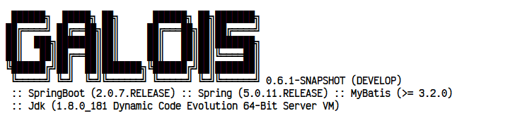

# galois

## 介绍

开源的springboot热部署工具，基于Java Agent方式

## 软件架构

+ 文件变动监听服务
    + 监听java、xml、class等文件变更，将变更交由各自的热部署服务处理
+ 实体热部署服务
    + 通过ASM工具，在项目启动阶段，修改关键类的实现（如MyBatis、SpringBoot相关上下文类），使其支持热更新服务

## 支持情况

| 框架                      | 支持情况 | 版本 |
|:------------------------|:----:|:--:|
| Java 代码                 |  ✔   | 8  |
| SpringBoot Controller接口 |  ✔   |    |
| SpringBoot XML配置文件      |  ✘   |    |
| MyBatis XML配置文件         |  ✔   |    |
| MyBatis 注解              |  ✘   |    |

## 使用说明

+ [给你的JVM装一个插件DCEVM](https://blog.csdn.net/NEWCIH/article/details/129093034?spm=1001.2014.3001.5501)
+ 配置项目JVM参数
    + 项目的启动参数中，添加 -javaagent:/XXX/galois.jar
+ 启动项目查看效果，出现该标识表示应用成功
  
